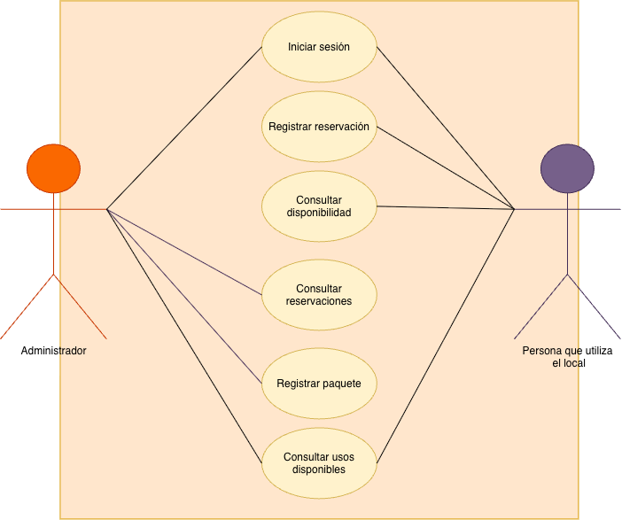

# Especificación de requisitos

**Sistema: Consulta de citas y paquetes**

**Autor: Jimena Morales Gómez**

**Versión: 2026**  

**Fecha de la última actualización: 01/septiembre/2026** 

---

## 1. Propósito y alcance

**Propósito del documento:**

Este documento tiene como propósito definir los requisitos del sistema de reservaciones y control de paquetes. Se especifican las funciones que deberá realizar el sistema, las condiciones que deberá cumplir y las necesidades de sus usuarios. El documento servirá como referencia durante el diseño, desarrollo y validación del sistema, además de permitir verificar posteriormente si los requisitos definidos fueron cumplidos.

**Alcance del sistema:**

El sistema estará enfocado en el control de las reservaciones de un local compartido y en el seguimiento de los paquetes de usos de las personas que lo utilizan. 

El sistema:

- Permite iniciar sesión para acceder a las funciones correspondientes a cada tipo de usuario
- Registra reservaciones indicando la persona, fecha y horario
- Muestra los horarios disponibles del cuarto
- Impide registrar dos reservaciones que coincidan en el mismo horario
- Registra paquetes de 5 o 10 usos asociados a una persona
- Muestra la cantidad de usos disponibles de cada paquete
- Identifica cuando una persona ha terminado los usos disponibles de su paquete

**Fuera del alcance:**

El sistema no incluye:

- Procesamiento de pagos o cobros bancarios.
- Control de inventario del negocio.
- Administración de citas de otros servicios del negocio.
- Contabilidad o administración financiera.
- Administración completa del negocio.

Estas funciones se excluyen porque el proyecto se enfoca únicamente en resolver los problemas relacionados con las reservaciones del local y el control de los paquetes.

---

## 2. Usuarios y su contexto

| Usuario | Qué hace hoy sin el sistema | Qué espera del sistema |
|---|---|---|
| Persona que utiliza el cuarto | Solicita un horario y depende de la administradora para saber si el local está disponible. También necesita llevar seguimiento de los usos de su paquete. | Consultar la disponibilidad del cuarto, realizar una reservación y conocer los usos disponibles de su paquete. |
| Administradora o encargada | Organiza las reservaciones y lleva manualmente el control de los paquetes y de los usos disponibles de cada persona. | Consultar las reservaciones, evitar empalmes y conocer cuántos usos le quedan disponibles a cada persona. |

**Conflictos identificados entre usuarios:**

La persona que utiliza el local busca tener facilidad y flexibilidad para elegir un horario disponible, mientras que la administradora necesita mantener un control sobre las reservaciones para evitar empalmes y llevar correctamente el conteo de los paquetes.

También es necesario que el sistema mantenga un equilibrio entre facilitar las reservaciones y respetar las reglas relacionadas con los usos disponibles de cada paquete.

---

## 3. Requisitos funcionales

### 3.1 Resumen

| ID | Nombre | Prioridad | Origen |
|---|---|---|---|
| RF-001 | Registrar reservación | Imprescindible | Entrevista con la encargada del negocio — 22/09/2026. |
| RF-002 | Consultar horarios disponibles | Imprescindible | Entrevista con la encargada del negocio — 22/09/2026. |
| RF-003 | Evitar empalmes | Imprescindible | Entrevista con la encargada del negocio — 22/09/2026. |
| RF-004 | Registrar paquete | Imprescindible | Entrevista con la encargada del negocio — 22/09/2026. |
| RF-005 | Consultar usos disponibles | Imprescindible | Entrevista con la encargada del negocio — 22/09/2026. |
| RF-006 | Consultar reservaciones | Imprescindible | Entrevista con la encargada del negocio — 22/09/2026. |
| RF-007 | Iniciar sesión | Importante | Supuesto propio por validar |
### 3.2 Fichas

*Una ficha por requisito, con los mismos campos siempre. Abajo va un ejemplo completo; bórralo cuando escribas los tuyos.*

#### RF-001 · Registro de consulta

| Campo | Contenido |
|---|---|
| **Descripción** | El sistema registra una reservación del cuarto con la persona, fecha y horario seleccionados. |
| **Origen** | Entrevista con la encargada del negocio |
| **Prioridad** | Imprescindible |
| **Criterio de aceptación** | Al ingresar una persona, una fecha y un horario disponible, la reservación queda registrada y puede consultarse posteriormente. |
| **Relacionado con** | RF-002, RF-003 |

#### RF-002 · Consultar horarios disponibles

| Campo | Contenido |
|---|---|
| **Descripción** | El sistema muestra los horarios que se encuentran disponibles para una fecha seleccionada. |
| **Origen** | Entrevista con la encargada del negocio |
| **Prioridad** | Imprescindible |
| **Criterio de aceptación** | Al seleccionar una fecha, se muestran los horarios disponibles y los horarios que ya tienen una reservación no aparecen como disponibles. |
| **Relacionado con** | RF-001, RF-003 |

---

#### RF-003 · Evitar empalmes

| Campo | Contenido |
|---|---|
| **Descripción** | El sistema impide registrar dos reservaciones del local que coincidan en el mismo horario. |
| **Origen** | Entrevista con la encargada del negocio. |
| **Prioridad** | Imprescindible |
| **Criterio de aceptación** | Si ya existe una reservación para una fecha y horario, al intentar registrar otra reservación en ese mismo espacio el sistema no permite registrarla. |
| **Relacionado con** | RF-001, RF-002 |

---

#### RF-004 · Registrar paquete

| Campo | Contenido |
|---|---|
| **Descripción** | El sistema registra un paquete de 5 o 10 usos y lo relaciona con la persona correspondiente. |
| **Origen** | Entrevista con la encargada del negocio. |
| **Prioridad** | Imprescindible |
| **Criterio de aceptación** | Al seleccionar una persona y registrar un paquete de 5 o 10 usos, el sistema guarda el paquete con la cantidad de usos correspondiente. |
| **Relacionado con** | RF-005 |

---

#### RF-005 · Consultar usos disponibles

| Campo | Contenido |
|---|---|
| **Descripción** | El sistema muestra la cantidad de usos que le quedan disponibles a una persona en su paquete. |
| **Origen** | Entrevista con la encargada del negocio. |
| **Prioridad** | Imprescindible |
| **Criterio de aceptación** | Al consultar el paquete de una persona, se muestra la cantidad de usos disponibles. Cuando llegue a cero, se indica que el paquete se encuentra agotado. |
| **Relacionado con** | RF-004, RNF-CON-001 |

#### RF-006 · Consultar reservaciones

| Campo | Contenido |
|---|---|
| **Descripción** | El sistema muestra las reservaciones registradas del cuarto. |
| **Origen** | Entrevista con la encargada del negocio |
| **Prioridad** | Imprescindible |
| **Criterio de aceptación** | Al consultar las reservaciones, el sistema muestra las reservaciones registradas con la persona, fecha y horario correspondientes. |
| **Relacionado con** | RF-001, RF-002, RF-003 |

#### RF-007 · Iniciar sesión

| Campo | Contenido |
|---|---|
| **Descripción** | El sistema valida las credenciales ingresadas para permitir el acceso al sistema  |
| **Origen** | Supuesto propio por validar con la encargada  |
| **Prioridad** | Importante |
| **Criterio de aceptación** | Al ingresar credenciales válidas, el sistema permite el acceso y muestra la sesión correspondiente al usuario. |
| **Relacionado con** | RF-001, RF-004, RF-005, RF-006 |

---

## 4. Requisitos no funcionales

### 4.1 Resumen

| ID | Atributo | Nombre | Prioridad | Origen |
|---|---|---|---|---|
| RNF-CON-001 | Confiabilidad | Consistencia de usos disponibles | Imprescindible | Derivado del tipo de sistema |
| RNF-USA-001 | Usabilidad | Facilidad para registrar una reservación | Importante | Derivado del tipo de sistema |
| RNF-CON-002 | Confiabilidad | Permanencia de reservaciones | Imprescindible | Supuesto por validar |

### 4.2 Fichas

#### RNF-CON-001 · Consistencia de usos disponibles

| Campo | Contenido |
|---|---|
| **Atributo de calidad** | Confiabilidad |
| **Descripción** | La cantidad de usos que muestra el sistema debe coincidir con la cantidad de usos registrados en el paquete de la persona. |
| **Métrica** | El 100% de las consultas debe mostrar correctamente los usos disponibles registrados en el paquete. |
| **Origen** | Derivado de la necesidad de llevar un control correcto de los paquetes. |
| **Prioridad** | Imprescindible |
| **Por qué importa** | Si el número de usos es incorrecto, una persona podría seguir utilizando el cuarto después de terminar su paquete o podría indicarse que ya no tiene usos cuando todavía le quedan disponibles y esto haría que mi cliente perdiera dinero. |
| **Afecta a** | RF-004, RF-005 |

---

#### RNF-USA-001 · Facilidad para registrar una reservación

| Campo | Contenido |
|---|---|
| **Atributo de calidad** | Usabilidad |
| **Descripción** | Un usuario nuevo puede registrar una reservación sin recibir capacitación previa. |
| **Métrica** | Durante una prueba, el usuario debe poder completar correctamente una reservación sin recibir ayuda para realizar el proceso. |
| **Origen** | Derivado del atributo de usabilidad definido para el sistema. |
| **Prioridad** | Importante |
| **Por qué importa** | El proceso debe ser sencillo para que las personas puedan utilizar el sistema sin depender de una explicación cada vez que quieran hacer una reservación. |
| **Afecta a** | RF-001, RF-002 |

---

#### RNF-CON-002 · Permanencia de reservaciones

| Campo | Contenido |
|---|---|
| **Atributo de calidad** | Confiabilidad |
| **Descripción** | Las reservaciones registradas deben seguir disponibles para su consulta después de salir y volver a ingresar al sistema. |
| **Métrica** | En una prueba con 10 reservaciones registradas, las 10 deben seguir apareciendo al volver a ingresar al sistema. |
| **Origen** | Supuesto propio por validar con la encargada. |
| **Prioridad** | Imprescindible |
| **Por qué importa** | Si una reservación desaparece, el horario podría mostrarse nuevamente como disponible y provocar un empalme. |
| **Afecta a** | RF-001, RF-002, RF-003 |

---

## 5. Casos de uso

### 5.1 Actores del sistema

Se identificaron dos actores principales:

- **Administradora:** inicia sesión, consulta las reservaciones, registra los paquetes y revisa los usos disponibles de cada persona.
- **Persona que utiliza el local:** inicia sesión, consulta la disponibilidad del cuarto, realiza reservaciones, consulta sus reservaciones y revisa los usos disponibles de su paquete.

### 5.2 Lista de casos de uso

| ID | Caso de uso | Actor principal |
|---|---|---|
| CU-01 | Registrar reservación | Persona que utiliza el local |
| CU-02 | Consultar disponibilidad | Persona que utiliza el local |
| CU-03 | Consultar reservaciones | Persona que utiliza el local / Administradora |
| CU-04 | Registrar paquete | Administradora |
| CU-05 | Consultar usos disponibles | Persona que utiliza el local / Administradora |
| CU-06 | Iniciar sesión | Persona que utiliza el local / Administradora |

### 5.3 Caso de uso principal

#### CU-01 · Registrar reservación

| Campo | Descripción |
|---|---|
| **Nombre** | Registrar reservación |
| **Actor principal** | Persona que utiliza el local |
| **Actor secundario** | Administrador |
| **Objetivo** | Registrar una reservación del local en una fecha y horario disponibles. |
| **Precondición** | La persona debe seleccionar una fecha y un horario para realizar la reservación. |
| **Resultado esperado** | La reservación queda registrada y el horario deja de aparecer como disponible. |

#### Escenario principal

1. La persona selecciona la opción para realizar una reservación.
2. El sistema solicita la fecha de la reservación.
3. La persona selecciona la fecha.
4. El sistema muestra los horarios disponibles para esa fecha.
5. La persona selecciona uno de los horarios disponibles.
6. El sistema muestra los datos de la reservación.
7. La persona confirma la reservación.
8. El sistema registra la reservación.
9. El sistema muestra la confirmación de que la reservación fue registrada.

#### Flujos alternos

**A1. El horario seleccionado ya no está disponible**

1. Al intentar confirmar la reservación, el sistema detecta que el horario ya tiene otra reservación.
2. El sistema no registra la nueva reservación.
3. El sistema informa que el horario ya no se encuentra disponible.
4. La persona puede seleccionar otro horario disponible.

**A2. La persona decide no confirmar la reservación**

1. Antes de confirmar la reservación, la persona decide cancelar el proceso.
2. El sistema no registra la reservación.
3. El proceso termina sin realizar cambios.

### Requisitos funcionales relacionados

Este caso de uso realiza los siguientes requisitos funcionales:

- **RF-001 · Registrar reservación:** permite registrar la reservación con la persona, fecha y horario seleccionados.
- **RF-002 · Consultar horarios disponibles:** permite consultar los horarios disponibles antes de realizar la reservación.
- **RF-003 · Evitar empalmes:** impide registrar una reservación si el horario ya se encuentra ocupado.
---

## 6. Trazabilidad

| Requisito | Origen | Caso de uso | Pantallas |
|---|---|---|---|
| RF-001 · Registrar reservación | Entrevista con la encargada | CU-01 · Registrar reservación | 02 · Seleccionar fecha / 03 · Horarios disponibles / 04 · Confirmar reservación / 05 · Reservación confirmada |
| RF-002 · Consultar horarios disponibles | Entrevista con la encargada | CU-02 · Consultar disponibilidad | 02 · Seleccionar fecha / 03 · Horarios disponibles |
| RF-003 · Evitar empalmes | Entrevista con la encargada | CU-01 · Registrar reservación | 03 · Horarios disponibles / 06 · Horario no disponible |
| RF-004 · Registrar paquete | Entrevista con la encargada | CU-04 · Registrar paquete | 01A-2 · Paquetes |
| RF-005 · Consultar usos disponibles | Entrevista con la encargada | CU-05 · Consultar usos disponibles | 01B · Mi cuenta / 01A-3 · Consultar usos disponibles |
| RF-006 · Consultar reservaciones | Entrevista con la encargada | CU-03 · Consultar reservaciones | 01A-1 · Reservaciones / 01B · Mi cuenta |
| RF-007 · Iniciar sesión | Supuesto propio por validar | CU-06 · Iniciar sesión | 00 · Iniciar sesión |
| RNF-CON-001 · Consistencia de usos disponibles | Derivado de la necesidad de controlar correctamente los paquetes | CU-04 / CU-05 | 01A-2 · Paquetes / 01A-3 · Consultar usos disponibles / 01B · Mi cuenta |
| RNF-USA-001 · Facilidad para registrar una reservación | Derivado del atributo de usabilidad | CU-01 / CU-02 | 02 / 03 / 04 / 05 |
| RNF-CON-002 · Permanencia de reservaciones | Supuesto propio por validar | CU-01 / CU-02 / CU-03 | No representado directamente en el prototipo |

---

## 7. Registro de cambios

| Fecha | Requisito | Qué cambió | Por qué |
|---|---|---|---|
| 01/10/2026 | RF-007 | Se agregó el requisito Iniciar sesión | El prototipo distingue el acceso de la administradora y de la persona que utiliza el local. Se mantiene como supuesto pendiente de validar. |
| 01/10/2026 | CU-01 y CU-02 | Se eliminó a la administradora como actor de estos casos de uso | Se definió que únicamente la persona que utiliza el local realiza reservaciones y consulta disponibilidad para reservar |
| 01/10/2026 | CU-03 | Se agregó a la persona que utiliza el local como actor | El prototipo permite que cada persona consulte sus propias reservaciones. |
| 01/10/2026 | Trazabilidad | Se agregaron las pantallas del prototipo | Se terminó el flujo navegable en Figma |

---
## Supuestos pendientes de validar

Durante el análisis también surgieron algunos puntos que todavía necesitan confirmarse con la encargada antes de convertirlos en requisitos:

- ¿En qué momento se descuenta un uso del paquete: al reservar, al iniciar la sesión o al terminarla?
- ¿Qué pasa con el uso del paquete si una persona cancela?
- ¿Qué pasa si una persona hace una reservación y no asiste?
- ¿Se puede cambiar la fecha o el horario de una reservación?
- ¿Quién puede modificar o cancelar una reservación?
- ¿Los paquetes siempre serán de 5 y 10 usos?
- ¿Se puede hacer una reservación futura si el paquete ya llegó a cero usos?
- ¿Cómo se registra la compra de un nuevo paquete después de utilizar el último uso?
-- ¿El sistema deberá requerir inicio de sesión para diferenciar el acceso de la administradora y de las personas que utilizan el local?
  
---
## Resultados de la entrevista

Después de realizar la entrevista, se revisaron los supuestos que se habían planteado al inicio del proyecto. Esto permitió confirmar algunas ideas, identificar aspectos que necesitaban cambios y encontrar situaciones que no se habían considerado inicialmente.

### Supuestos que se confirmaron

- Los paquetes que se manejan actualmente son de 5 y 10 usos.
- No se deben tener dos reservaciones del cuarto en el mismo horario.
- Es necesario llevar un control de los usos disponibles de cada persona.
- La encargada necesita consultar las reservaciones para conocer la disponibilidad del cuarto.
- Cuando una persona utiliza la última sesión de su paquete, puede terminar esa sesión normalmente, pero necesita adquirir un nuevo paquete para continuar utilizando el local posteriormente.
- Uno de los principales problemas es que pueden existir errores en el control de los horarios y de los usos disponibles.

---

### Supuestos que resultaron falsos

- Al inicio se consideró incluir el control de inventario dentro del sistema, pero se determinó que no forma parte del problema principal que se busca resolver
- Se pensó que el proyecto debía abarcar diferentes procesos del negocio, pero se decidió centrarlo únicamente en las reservaciones del local y el control de paquetes

---

### Información que apareció y no esperábamos

- Puede ocurrir que una persona llegue al último uso de su paquete sin que la encargada identifique inmediatamente que ya terminó sus sesiones
- Además de evitar empalmes, es importante relacionar el control de las reservaciones con los usos disponibles de cada paquete
- Surgió la necesidad de definir qué sucede cuando una persona cancela una reservación o no asistea a la cita
- También es necesario definir qué sucede cuando una persona quiere cambiar la fecha o el horario de una reservación
- Falta confirmar en qué momento se debe descontar un uso del paquete
  
---

### Cambios realizados después de la entrevista

- Se delimitó el sistema a las reservaciones del cuarto y al control de paquetes
- Se dejó fuera del alcance el control de inventario y otros procesos administrativos del negocio
- Se estableció como requisito evitar reservaciones que coincidan en el mismo horario
- Se agregó el control de paquetes de 5 y 10 usos
- Se agregó la consulta de los usos disponibles de cada persona
- Las reglas relacionadas con cancelaciones, inasistencias, cambios de horario y el momento en que se descuenta un uso se mantienen pendientes hasta ser confirmadas

---

### Diagrama de casos de uso

### Revisión con dupla 

### Cesar Alejandro Méndez Yepez

